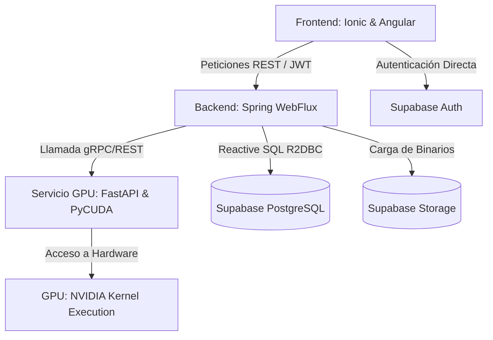

# UPSGlam 3.0 — Sistema Social de Procesamiento Digital de Imágenes en GPU

UPSGlam 3.0 es una plataforma social estilo Instagram que permite a los usuarios publicar fotos, interactuar mediante Likes, Reposts, Seguidos y Comentarios, y aplicar filtros avanzados de procesamiento digital de imágenes acelerados por hardware en la GPU (utilizando **NVIDIA CUDA** y **PyCUDA**).

---

## 1. Arquitectura del Sistema

El sistema está diseñado bajo una arquitectura de microservicios dockerizada e impulsada por eventos reactivos:



### Componentes Principales:
1. **Frontend (Ionic Angular Standalone):** Una aplicación móvil/web responsiva. Renderiza el feed público con interacciones de likes (autolikes soportados), comentarios en un panel deslizable, reposteo de publicaciones y botones de seguimiento (Seguir/Siguiendo) integrados. En la pestaña de Perfil, permite ver los posts propios y reposteados, eliminar posts, quitar reposteos, consultar las listas flotantes de seguidores/seguidos para gestionar relaciones de seguimiento y visualizar el historial de métricas GPU de procesamiento de cada foto.
2. **Backend (Spring WebFlux):** API reactiva y no bloqueante construida con Java 21 y Spring Boot 3. Gestiona la seguridad mediante tokens JWT emitidos por Supabase, orquesta las cargas a Storage, se comunica reactivamente con la base de datos a través de **R2DBC**, gestiona el ecosistema de seguidores y reposteos, y coordina el envío de imágenes al servicio CUDA.
3. **Servicio GPU (FastAPI + PyCUDA):** Microservicio escrito en Python 3.10. Utiliza PyCUDA para compilar dinámicamente y ejecutar kernels escritos en C/C++ directos en la GPU. Soporta 6 filtros: Laplaciano, Sobel, Promedio (Box Blur), Nitidez, Mediana y Marca de Agua UPS.
4. **Base de Datos y Almacenamiento (Supabase):**
   * **PostgreSQL:** Tablas optimizadas para perfiles, publicaciones, likes, comentarios, seguidores, reposteos  e historial de rendimiento de GPU.
   * **Supabase Storage:** Almacenamiento de objetos dividido en dos buckets públicos: `originals` (imágenes de entrada) y `processed` (resultados del procesamiento GPU).

---

## 2. Configuración de Supabase

El backend y el frontend se sincronizan con Supabase para la autenticación y la persistencia de datos.

### A. Preparación del Schema de Base de Datos
Debes ejecutar el archivo [supabase_setup.sql](file:///home/tania/Documents/compu/UPSGLAM3.0/supabase_setup.sql) en el **SQL Editor** de tu consola de Supabase. Este script realiza lo siguiente:
1. Crea las tablas principales: `profiles`, `filters`, `posts`, `likes`, `comments`, `processing_history`, `follows`, `reposts` y `gpu_metrics`.
2. Inserta los filtros base en la tabla `filters` (ej. `marca_agua_ups`).
3. Define un **Trigger y una Función** (`handle_new_user`) para que cada vez que un usuario se registre en la sección de autenticación de Supabase, se cree automáticamente su perfil correspondiente en la tabla pública `profiles`.

### B. Buckets de Almacenamiento
Crea los siguientes dos buckets públicos en la sección de **Storage** de Supabase:
* `originals` (Acceso público de lectura)
* `processed` (Acceso público de lectura)

### C. Variables de Entorno
Crea un archivo `.env` en la raíz del proyecto con tus credenciales de Supabase:
```env
SUPABASE_URL=https://<TU-PROYECTO>.supabase.co
SUPABASE_ANON_KEY=<TU-ANON-KEY>
SUPABASE_SERVICE_KEY=<TU-SERVICE-ROLE-KEY>
SUPABASE_JWT_SECRET=<TU-JWT-SECRET>
SUPABASE_DB_URL=r2dbc:postgresql://<HOST-DE-BD>:5432/postgres
SUPABASE_DB_USER=postgres.<TU-PROYECTO>
SUPABASE_DB_PASSWORD=<TU-PASSWORD-DE-BD>
```

---

## 3. Dockerización y Despliegue

La solución está completamente dockerizada y lista para levantarse con un solo comando.

### Dockerfiles por Servicio:
* **Backend:** `/backend/Dockerfile` (Compilación Maven y JDK 21 en imagen ligera).
* **Servicio CUDA:** `/cuda-service/Dockerfile` (Utiliza la imagen `nvidia/cuda:12.8.0-devel-ubuntu22.04` para compilar los kernels en GPU. Instala las librerías del sistema `libcairo2` para soportar la rasterización del logo SVG de la universidad).
* **Frontend:** `/frontend/Dockerfile` (Instala dependencias de Angular/Ionic, compila en modo producción y sirve la aplicación en el puerto `8100`).

### Docker Compose:
El archivo `docker-compose.yml` une los contenedores dentro de la red compartida `upsglam-net`. Para dar soporte de GPU al contenedor de CUDA, se utiliza la sección `deploy`:
```yaml
    deploy:
      resources:
        reservations:
          devices:
            - driver: nvidia
              count: all
              capabilities: [gpu]
```

---

## 4. Uso y Ejecución

### Prerrequisitos
1. **Docker y Docker Compose** instalados en el sistema anfitrión.
2. **NVIDIA Container Toolkit** configurado en el sistema operativo anfitrión (Linux) para que Docker tenga acceso a la tarjeta de video física (GPU).

### Comandos de Ejecución

1. **Construir y levantar el sistema por primera vez:**
   ```bash
   docker compose up --build -d
   ```
   *(Este comando descargará las imágenes base, instalará dependencias, compilará la aplicación web y los kernels CUDA de forma automática).*

2. **Verificar el estado de los contenedores:**
   ```bash
   docker compose ps
   ```

3. **Ver logs de ejecución (ej. de la GPU):**
   ```bash
   docker compose logs -f cuda-service
   ```

### Acceso a los Servicios
* **Frontend de la App:** `http://localhost:8100`
* **API del Backend:** `http://localhost:8080`
* **API del Servicio CUDA:** `http://localhost:8001`

---

## 5. Guía de Uso del Aplicativo

1. **Autenticación:**
   * Abre `http://localhost:8100`. Registra una cuenta o inicia sesión.
   * *Nota técnica:* El frontend almacena el token JWT devuelto por Supabase para firmar todas las peticiones posteriores mediante la cabecera `Authorization: Bearer <TOKEN>`.
2. **Publicar Imagen:**
   * Ve a la pestaña **Publicar** (+). Selecciona una imagen desde tu equipo.
   * Escribe una descripción y selecciona uno de los filtros GPU de la lista (ej. **Marca de Agua UPS** para superponer el logo universitario `logoupscolor.svg`).
   * Haz clic en **Publicar**.
3. **Interacciones Sociales (Inicio):**
   * En el feed verás la foto procesada final.
   * Puedes dar Like pulsando en el icono del corazón (cambiará a rojo y aumentará el contador).
   * Pulsa la burbuja de diálogo para abrir la sección de comentarios deslizante, donde podrás redactar un comentario o borrar los tuyos.
   * **Seguir/Siguiendo:** Puedes seguir a otros usuarios directamente desde sus publicaciones haciendo clic en el botón **Seguir**. El botón cambiará dinámicamente a **Siguiendo**.
   * **Repostear:** Haz clic en el icono de reposteo (flechas circulares) al lado de los comentarios para compartir el post. El icono cambiará a color verde y se sumará al contador global de reposteos.
4. **Visualización, Seguidores y Reposts (Perfil):**
   * Ve a la pestaña **Perfil** para ver la cuadrícula de tus publicaciones en el segmento **Posts**.
   * Haz clic en cualquier foto de la cuadrícula para abrirla en **tamaño grande**, mostrando el nombre del filtro GPU aplicado y su descripción. Si es un post propio, podrás eliminarlo usando el botón rojo **Eliminar publicación**.
   * Cambia al segmento **Reposts** para ver todos los posts de otros usuarios que has compartido. Al abrirlos, podrás eliminarlos de tus reposteos usando el botón **Quitar Repost**.
   * Haz clic en el número de **Seguidores** o **Seguidos** en la cabecera de tu perfil para desplegar una lista flotante de los usuarios correspondientes. Desde allí podrás seguirlos de vuelta ("Seguir de vuelta") o dejar de seguirlos ("Dejar de seguir") en tiempo real.
   * Cambia al segmento **Historial GPU** para ver la bitácora técnica de rendimiento de cada procesamiento (Dimensión del bloque, grid, cantidad de hilos lanzados y tiempo exacto de ejecución del kernel de la GPU en milisegundos).
